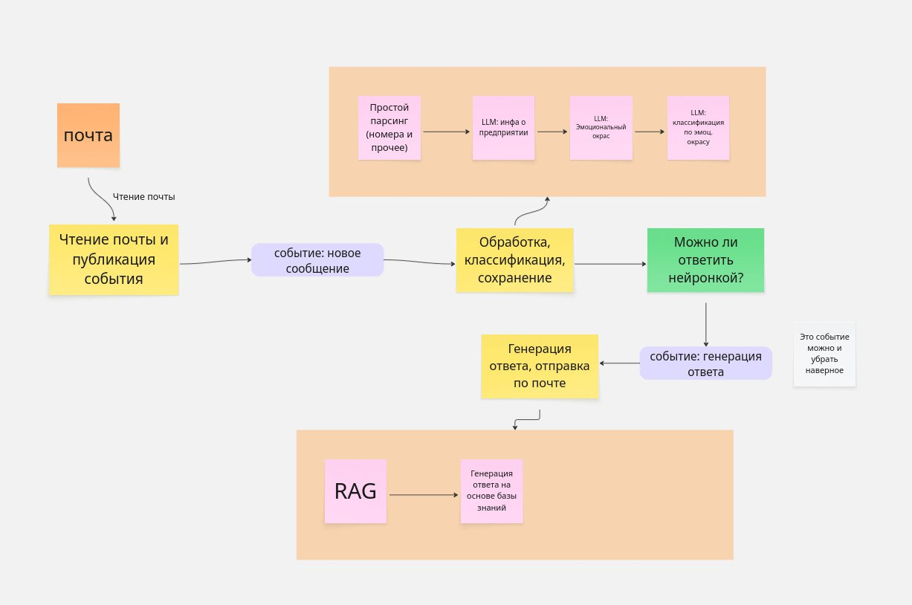
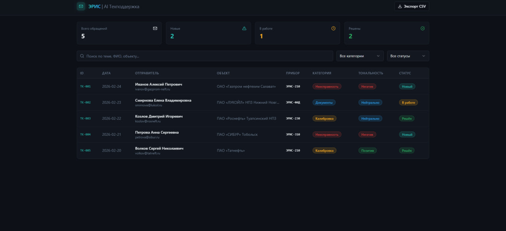
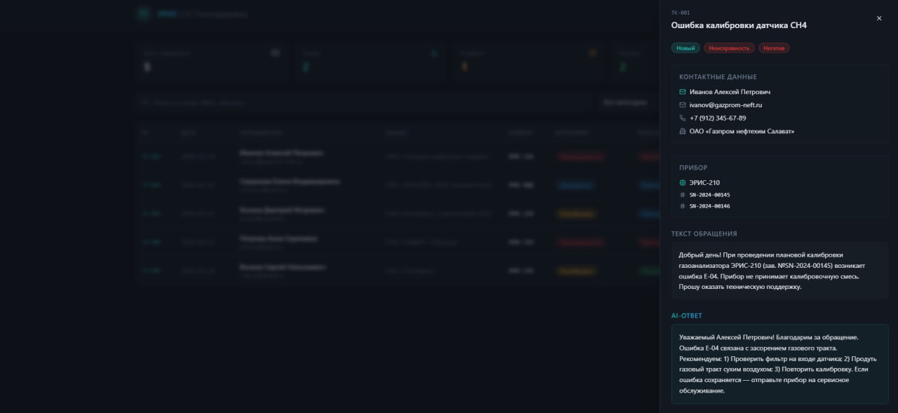
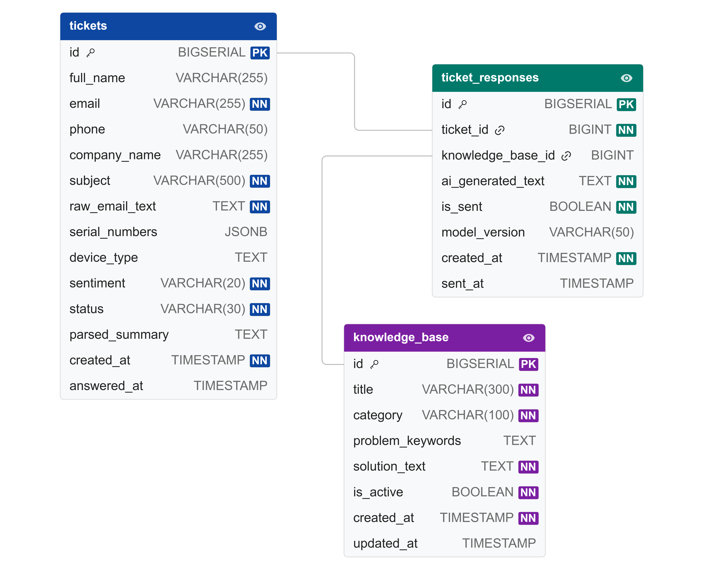

# enigma-collapse
## 📝 О проекте
Данное решение направлено на автоматизацию работы службы технической поддержки компании **«ЭРИС»** — ведущего производителя газоаналитического оборудования. Система берет на себя рутинную работу по разбору входящей почты, извлечению технических данных и подготовке первичных ответов.

### Основная цель:
Создать интеллектуальный «конвейер», который сокращает время реакции на запрос клиента на 50% и минимизирует ошибки ручного ввода данных.

---

## 👥 Команда проекта
*   **Team Lead:** [Крохалев Дмитрий] — Архитектура системы, управление рисками, документация.
*   **Backend Developer:** [Яковлев Алексей] — Логика API, интеграция с PostgreSQL и Email-сервисами.
*   **Frontend Developer:** [Климов Николай] — Разработка интерфейса таблицы, системы фильтров и экспорта.
*   **AI/ML Engineer:** [Безнутров Александр] — Настройка моделей NLP для анализа тональности и извлечения сущностей.
*   **Data Analyst:** [Кряжевских Виктория] — разработка структуры дашбордов и логики отчетности.

---

## 🚀 Основные функции (MVP)
*   **Интеллектуальный парсинг:** Автоматическое извлечение из писем ФИО, названий объектов, контактных телефонов и **заводских номеров приборов**.
*   **Анализ тональности:** Определение эмоционального окраса письма (позитивный, нейтральный, негативный) для приоритизации ответов.
*   **Генерация ответов (RAG):** Поиск технических решений в базе знаний (руководства по эксплуатации, FAQ) и формирование проекта ответа.
*   **Рабочее место оператора:** Веб-интерфейс в виде таблицы с возможностью фильтрации, редактирования ответов и экспорта данных в CSV/XLSX.

---

## 🛠 Технологический стек
*   **Backend:** Java, Spring, Kafka.
*   **Database:** PostgreSQL.
*   **Frontend:** Angular / TypeScript, Taiga UI, Scss.
*   **Email Integration:** IMAP (получение), SMTP (отправка).
*   **DevOps:** Docker, Docker-compose.

---

## 🏗 Архитектура системы
1.  **Email Worker:** Модуль мониторинга почтового ящика, скачивание новых писем.
2.  **AI Processing:** Анализ текста, классификация категории (неисправность/калибровка/документы) и экстракция сущностей.
3.  **Knowledge Base Search:** Семантический поиск по технической документации.
4.  **API Service:** Серверная часть, управляющая логикой и связью между БД и фронтендом.
5.  **Web UI:** Таблица для оператора, где происходит финальная валидация и отправка письма.

---

## 🗺 Пользовательский путь (User Journey)

Процесс взаимодействия с системой глазами оператора техподдержки:

1.  **Сбор данных:** Письмо клиента поступает на сервер. Система мгновенно извлекает ФИО, объект, модель прибора и серийный номер.
2.  **Оценка приоритета:** AI-агент определяет тональность письма. Если клиент крайне недоволен (негатив), заявка подсвечивается красным и поднимается в топ.
3.  **Работа в веб-таблице:** Оператор открывает личный кабинет, где видит список всех заявок. К каждой заявке уже прикреплен краткий пересказ (Summary) и категория вопроса.
4.  **Валидация решения:** При открытии заявки оператор видит оригинал письма и сгенерированный ИИ ответ. На основе предоставленных ссылок на базу знаний (инструкции) оператор подтверждает или корректирует ответ.
5.  **Завершение:** После нажатия кнопки «Отправить», система шлет ответ клиенту и переносит данные в архив для отчетности.

---

## ⚠️ Анализ рисков и минимизация (Хакатон: 24 часа)

| Риск | Описание | Стратегия минимизации |
| :--- | :--- | :--- |
| **Сжатые сроки (24ч)** | Невозможность реализовать "идеальный" ИИ с нуля. | Использование предобученных моделей и фокус на базовом сценарии (MVP). |
| **Галлюцинации ИИ** | Некорректный технический совет клиенту по газоанализатору. | Принцип **Human-in-the-loop**: ИИ только предлагает ответ, последнее слово всегда за оператором. |
| **Сложность парсинга** | Разнообразие форматов писем от клиентов. | Использование регулярных выражений в связке с NLP-моделями для повышения точности извлечения серийных номеров. |
| **Проблемы с Email API** | Трудности с доступами к реальным почтовым серверам (SSL/TLS). | Разработка системы на моках (заготовленных JSON-письмах) с последующим подключением реального протокола. |

---

## Некоторые дополнительные сведения 

### Набросок архитектуры верхнеуровнево:

### Референисы Web-таблицы:

### Схема БД:

